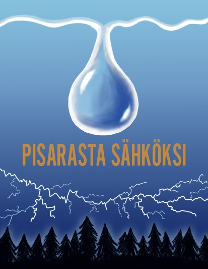

# Personal portfolio by Julia Korhonen
This portfolio includes school projects. 

## Online game store
[This website](http://gamestore-torque.herokuapp.com/store/index) is an online game store made for Web Software Development course. It was done in a group of three. 
In this project my responsibilities were:
- Game/service interaction (save, load, resolution and submit features for games using django and JavaScript)
- Basic version of adding and displaying games
- Browse games view, basic player functionalities (play games, filter games by category, search bar)
- High score lists
- Front page (except images)
- Basic HTML structure and CSS
- Front end (CSS, Bootstrap) for Browse and play games, High scores, Front page, Developer view, Cart

## Responsive website
[This website](https://juliakorhonen.github.io/Responsive-website) was done as a project for Responsive Web Design course at VIA University College, Aarhus, Denmark in 2018. It was made together with Jesse Nukarinen. It includes responsive design and works in multiple resolutions, including mobile. 

## Video project for Swedish course
This video below was made for oral exam of Swedish for Technology course at Aalto University in 2017. The video is edited with Sony Vegas. 
<iframe width="560" height="315" src="https://www.youtube.com/embed/EWi6ppZviQc" frameborder="0" allow="accelerometer; autoplay; encrypted-media; gyroscope; picture-in-picture" allowfullscreen></iframe>

## Small hydro campaign poster
This campaign poster was made with Adobe Photoshop for Basics of Web Publishing course at Aalto University in 2018.

